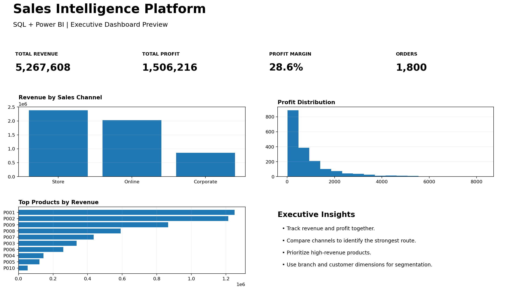

# Sales Intelligence Platform

## 📊 SQL & Power BI Business Intelligence Project

An end-to-end Business Intelligence project designed to analyze sales performance and transform raw transactional data into actionable business insights.

The project demonstrates practical skills in SQL, data modeling, KPI analysis, and Power BI dashboard design.

---

## 🎯 Project Objective

The objective is to help management understand:

- Revenue and profit performance
- Best and worst-performing products
- Branch performance
- Customer behavior
- Sales channel performance
- Profit margins and business KPIs
- Opportunities for improving sales performance

---

## 🛠️ Technologies

- SQL
- Power BI
- DAX
- Data Analysis
- Business Intelligence
- Data Modeling
- CSV / Relational Data

---

## 🗂️ Dataset

The project contains:

- 1,800+ sales transactions
- 100 customers
- 10 products
- 5 branches
- Multiple sales channels

### Main Tables

| Table | Description |
|---|---|
| `fact_sales` | Sales transactions |
| `dim_product` | Product information |
| `dim_customer` | Customer information |
| `dim_branch` | Branch information |

---

## 🔍 SQL Analysis

SQL queries were developed to analyze:

- Total Revenue
- Total Profit
- Average Order Value
- Profit Margin
- Monthly Sales
- Product Performance
- Branch Performance
- Customer Performance
- Sales Channels

---

## 📈 Power BI Dashboard

The planned dashboard includes:

### Executive KPIs

- Total Revenue
- Total Profit
- Profit Margin
- Total Orders
- Average Order Value

### Sales Analysis

- Revenue by month
- Revenue by branch
- Revenue by product
- Revenue by sales channel

### Business Insights

The dashboard is designed to help decision-makers quickly identify trends, high-performing areas, and potential business opportunities.

---

## 💼 Business Value

This solution can support management in making data-driven decisions by providing a centralized view of sales performance.

Potential business applications include:

- Identifying high-performing products
- Improving branch performance
- Understanding customer behavior
- Optimizing sales channels
- Monitoring profitability
- Supporting strategic planning

---

## 📁 Project Structure

```text
sales-intelligence-platform/
│
├── 01_database_and_queries.sql
├── 02_powerbi_blueprint.md
├── 03_business_case.md
├── README.md
│
├── dim_branch.csv
├── dim_customer.csv
├── dim_product.csv
└── fact_sales.csv

## 👨‍💻 Skills Demonstrated

- SQL Query Development
- Data Modeling
- Data Cleaning
- KPI Development
- Business Analysis
- Power BI Dashboard Planning
- Data-Driven Decision Making

---

## 🚀 Future Improvements

- Add a fully interactive Power BI dashboard
- Add advanced DAX measures
- Add automated data refresh
- Add predictive sales analysis
- Add customer segmentation
- Add forecasting models

---
## 📊 Dashboard Preview




## 👤 Author

**Salman Al Juhani**

Information Systems Student

**Skills:** SQL | Power BI | Data Analysis | Business Intelligence
